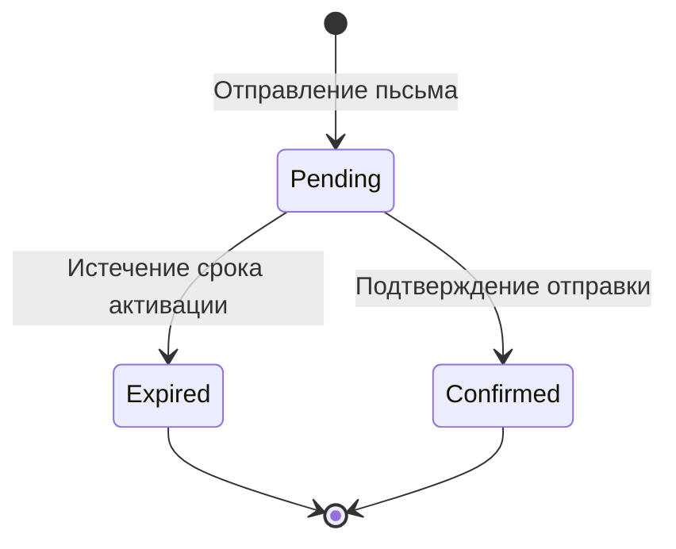
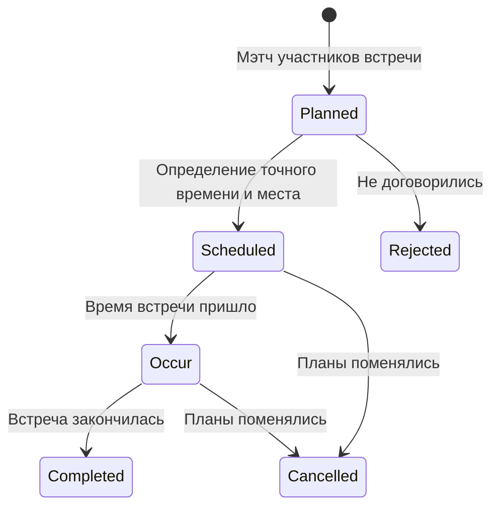

# Spring 2024 Random Coffee

## Понятия

Структура понятий:

Понятие на русском `Concept in English` Тип понятия
Описание понятия

Типы понятий:

| Обозначение | Расшифровка | Краткое описание | Описание |
| --- | --- | --- | --- |
| E | Entity | Сущность | Описывает понятие которое имеет идентичность и жизненный цикл (часто не описаный явно) |
| T | Type | Тип, обычно str enum  | Определяет ограничения на значения, которые может принимать переменная величина. Описание понятия призвано явно описать что значит эта величина. |
| S | Service | Сервис | Описывает бизнес-логику |

### Организация `Organisation` E

Организация, в которой могут состоять сотрудники.

1. Название
2. Почтовый домен

### Человек `Person` E

1. Аккаунт
2. Телеграм аккаунт
3. ФИО
4. Город дислокации (необязательно)
5. Предпочтения по 
6. Предпочтения по формату встречи (онлайн/оффлайн)

Условия консистентности

1. В реальной жизни этот человек действительно существует
2. Недопустимо наличие нескольких записей, указывающий на одного человека

Замечание: условия консистентности 1 и 2 выполняются частично. См `Сессия идентификации`.

### Аккаунт `Account` E

В модели *авторизации* challenge-response, данная модель содержит информацию для воспроизведения challenge и проверки response.

1. Корпоративная электронная почта
2. Пароль

### Сотрудник `Employee` E

Человек, который имеет должность в какой-либо организации.

1. Организация
2. Должность
3. Подразделение (необязательно)

Сотрудник может быть прикреплен сразу к нескольким организациям.

### Сессия идентификации `Identification Session` E

Сессия идентификации человека. В данный момент поддерживается только для сотрудников.

При создании человека нам нужно обеспечить

1. Факт существования такого человека в реальности
2. Факт отсутствия этого человека среди уже идентифицированных людей

Это можно было бы сделать, например, с помощью паспорта. Но т.к. мы концептуально постоянно привязаны к организациям, мы будем рассматривать вопрос в контексте идентификации сотрудника.

При создании сотрудника нужно обеспечить

1. Консистентное (целостное, непротиворечивое, выполняющее условия выше) создание человека
2. Факт принадлежности человека к определенной организации

В нашем случае, есть простой способ идентификации сотрудника: при регистрации, сотрудник указывает свою рабочую почту, и мы проверяем, что у него есть доступ к чтению писем на этой почте. Доступ обозначает, что

1. Человек действительно существует, и он не был занесен в систему ранее
2. Человек действительно является сотрудником организации (определяем по домену почты)

со следующими допущениями

1. Организация выдает адреса только своим сотрудникам
2. Человек работает в одной организации

Данные допущения составляют неполноту консистентности `людей` в системе.

Сессия идентификации создается при отправлении электронного письма с подтверждением. Сессия может быть подтверждена в течение одного дня. Если пользователь подтверждает ее, состояние изменяется на потвержденная`Confirmed`. Иначе, по истечении срока активации, сессия считается истекшей `Expired`.

### Роль `Role` T

Роль (должность) человека *в нашем приложении*. Есть следующие роли

1. Сотрудник организации `Employee`
2. Администратор организации `Administrator`
3. Участник встречи `Meeting participant`

Определенная роль позволяет выполнять человеку определенный набор действий.

Замечательно, что бывают роли, которые позволяют человеку действия только в рамках другой сущности. Например, если человек является сотрудником организации А, это означает, что он может встречаться с сотрудниками из организации А.

Примеры из речи:

> Сотрудник организации А может назначать встречи в организации А.
> 

> Администратор организации А может просматривать статистику встреч пользователей из организации А.
> 

По умолчанию, все люди являются сотрудниками какой-либо организации. Однако если человека исключают из организации, он перестает им быть. Но роли участника встречи сохраняются.

### Должность `Organisation Post` T

Должность сотрудника в организации. Каждая организация имеет свой набор должностей.

### Подразделение организации `Organisation Unit` E

В подразделение входят сотрудники, которые занимаются задачами определенной направленности. Каждая организация имеет свой, уникальный набор подразделений.

### Встреча `Meeting` E

Встреча, которая планируется при помощи нашего приложения. Имеет

1. Состояние `Meeting State`. Определяет этап жизненного цикла.
2. Набор участников (два и более)
3. Обстоятельства встречи

За назначение встреч отвечает сервис метчинга.

### Обстоятельства встречи `Meeting circumstances` E

Конкретные обстоятельства при которых проходит встреча, которые определяются в ходе произвольного разговора участников встречи.

1. Место проведения
2. Дата и время проведения
3. Длительность (в минутах)

### Участник встречи `Meeting participant` E

Сотрудник в контексте участия в какой-либо встрече. Сущность пока не имеет особых свойств.

### Состояние встречи `Meeting state` T

Может иметь следующие значения

1. В ожидании `Pending`. У встречи определен только один участник. Ожидание второго участника.
2. Встреча отменена до создания `Stale`. Отмена встречи после безрезультатного ожидания второго участника.
3. Создана `Created`. Встреча считается созданной, когда встреча полностью создана, но в ней, не определены конкретные обстоятельства. Участники встречи должны лично договориться о месте и времени проведения встречи.
4. Запланирована `Planned`. Встреча считается запланированной сразу после начала.
5. Происходит `Occur`. Встреча происходит в данный момент.
6. Завершена `Completed`. Встреча успешно состоялась.
7. Отменена `Cancelled`. Встреча по какой-то причине была отменена.
8. Отклонена `Rejected`. Участники не смогли запланировать встречу.

### Формат встречи `Meeting format` T

Формат, в котором проходит встреча

1. Оффлайн `Offline`
2. Онлайн `Online`

### Сервис встреч `Meeting service` S

Данный сервис отвечает за логику создания встреч.

Встреча может быть создана двумя путями

1. По инициативе сотрудника
2. По расписанию

Во всех случаях собеседник выбирается случайно через сервис мэтчинга.

### Сервис мэтчинга `Matching service` S

Данный сервис ответственен за определение групп людей, которые должны встретится. Сервис может обрабатывать две ситуации

1. Нужно поделить по группам множество людей, которые должны встретится. Такой кейс обычно возникает при назначении встреч по расписанию.
2. Нужно найти пару человеку, который хочет встретится вне общего расписания. Выбор пары происходит только из таки-же людей.

Данный сервис должен работать с предпочтениями человека, побирая для него наиболее релевантные встречи. 

Первый вариант должен обрабатывать различные корнер кейсы, которые могут возникнуть в условиях второго варианта. Думаю, второй вариант можно свести к первому, так будет лучше. Например, сделать, чтобы все pending встречи каждый день проходили процесс метчинга между собой. Это позволит сделать подбор более точным, не сильно повлияв на сторонний пользовательский опыт.

### Мэтчинг группа `Matching group` E

Множество людей, которые ждут мэтчинга (присоединения к какой-то встрече). В общем случае, каждая организация имеет мэтчинг группу. Однако мне кажется, что убирать эту сущность из-за отношения 1 к 1 приведет к недостаточной явности определения понятия.

### Блуждающий сотрудник `Wonderring employee`

Сотрудники, которые ищут себе напарника для встречи.

## Пользовательские истории

- Регистрация через корпоративную почту.
- Просмотр текущей встречи, с возможностью удобно перейти к телеграмму собеседника по кнопке, и возможностью отменить встречу
- Возможность заполнять в просмотре встречи ее обстоятельства: дату/время, длительность и место.
- Индикация того, что человек находится в поиске встречи.
- Возможность внепланово начать искать встречу.

Регистрация сотрудника

1. Логин (ФИО)
2. Пароль
3. Email
4. Город

Профиль

1. Фото
2. Дата рождения 
3. Пол
4. Семейное положение
5. Отдел
6. О себе
7. Телеграм
8. Желаемое кол-во встреч в неделю
9. Продолжительность встречи
10. Формат встречи
11. Место встречи (для оффлайн формата)

Особые права администратора. 

1. Добавить сотрудника
2. Смотреть статистику

      * Состоялась/не состоялась встреча

      * Длительность встречи

      * Кол-во встреч

1. Удалить сотрудника
